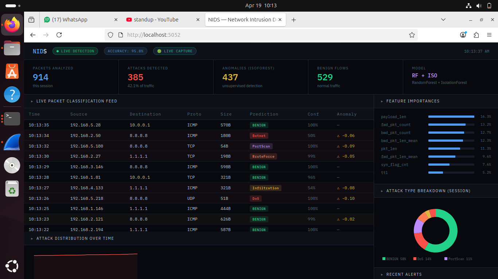
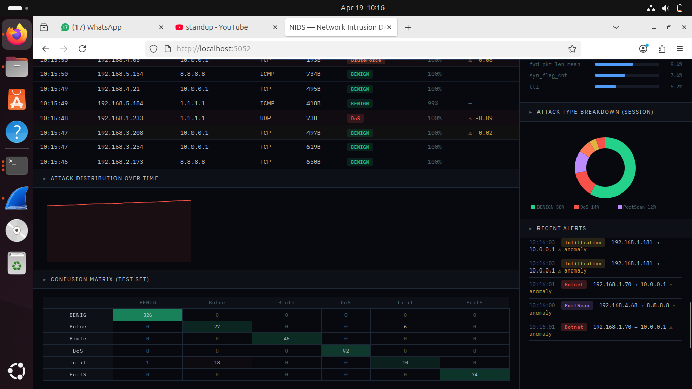
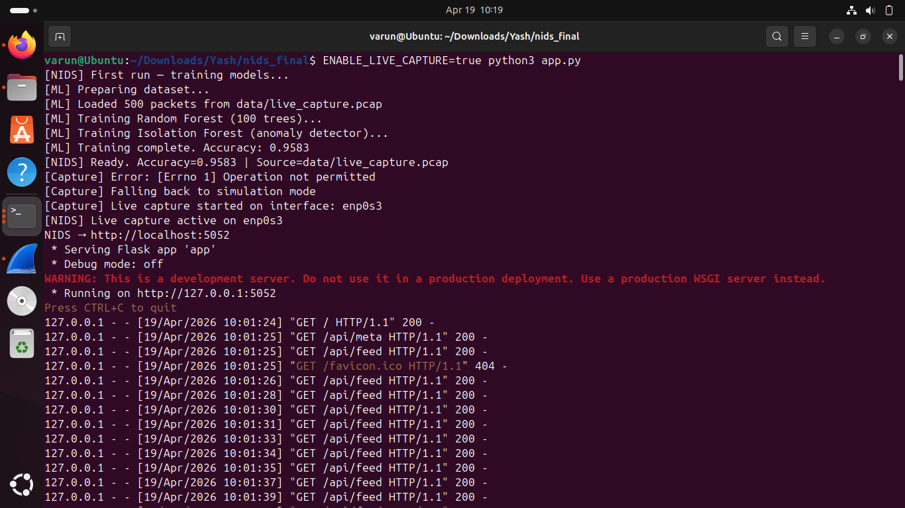

**[Live Demo](https://nids-bm2r.onrender.com)**


# Network Intrusion Detection System

A tool that watches network traffic and flags suspicious activity using machine learning. It reads packets from your network interface (or a saved capture file), pulls out features like packet size, TCP flags, and port numbers, then runs them through a classifier to decide if something looks like a DoS attack, port scan, brute force attempt, or normal traffic.

Trained on real packet captures using Scapy. Comes with a live dashboard so you can watch classifications happen in real time.





---

## How it works

Packets come in → 17 features get extracted (TTL, TCP flags, ports, payload size, inter-arrival time etc.) → two models run on those features:

- **Random Forest** — supervised, trained on labeled traffic, classifies into 6 categories
- **Isolation Forest** — unsupervised, trained only on normal traffic, flags anything that deviates

The six categories: Benign, DoS, Port Scan, Brute Force, Infiltration, Botnet.

Results show up on the dashboard with confidence scores, a confusion matrix, and feature importances so you can see what the model is actually paying attention to.

---

## Stack

Python, Flask, Scapy, Scikit-learn, Wireshark/tshark, Pandas, NumPy

---

## Setup

### Windows

```bash
git clone https://github.com/yourusername/nids.git
cd nids
pip install -r requirements.txt
mkdir data models
python app.py
```

Open `http://localhost:5052`. Runs in simulation mode on Windows since live capture needs admin and Npcap. Everything else works the same.

For live capture on Windows: install Npcap from npcap.com, run terminal as Administrator, then:

```bash
set ENABLE_LIVE_CAPTURE=true
python app.py
```

---

### Linux / Linux VM

```bash
sudo apt update
sudo apt install python3 python3-pip git wireshark tshark tcpdump -y
# say YES when asked about non-superusers capturing packets

sudo usermod -aG wireshark $USER
newgrp wireshark

git clone https://github.com/yourusername/nids.git
cd nids
mkdir data models
pip3 install -r requirements.txt --break-system-packages
```

Capture traffic (find your interface with `ip a`):

```bash
sudo tcpdump -i enp0s3 -w data/live_capture.pcap -c 500
# browse some websites while this runs so there's actual traffic
```

Check the capture:

```bash
tshark -r data/live_capture.pcap | head -50
```

Run:

```bash
ENABLE_LIVE_CAPTURE=true python3 app.py
```

First run trains the models automatically (~10 seconds). Open `http://localhost:5052`.

---

## API

| Endpoint | Method | What it does |
|---|---|---|
| `/` | GET | Dashboard |
| `/api/feed` | GET | Last 40 classified packets + stats |
| `/api/meta` | GET | Model accuracy, confusion matrix, feature importances |
| `/api/predict` | POST | Classify a custom packet (send features as JSON) |
| `/api/retrain` | POST | Retrain on whatever is in data/live_capture.pcap |

---

## Using your own pcap

Drop any `.pcap` at `data/live_capture.pcap` and hit:

```bash
curl -X POST http://localhost:5052/api/retrain
```

Model retrains and reloads automatically.

---

## Deploying

Deployed on Render. Push to GitHub, connect on render.com as a Web Service.

Build Command: `pip install -r requirements.txt`
Start Command: `gunicorn app:app --bind 0.0.0.0:$PORT --workers 2 --timeout 120`

Note: free tier sleeps after 15 min inactivity, takes ~30 seconds to wake on first visit.

---

## Dataset

Synthetic fallback matches CICIDS2017 statistical distributions (Canadian Institute for Cybersecurity). For real data: unb.ca/cic/datasets/ids-2017.html
